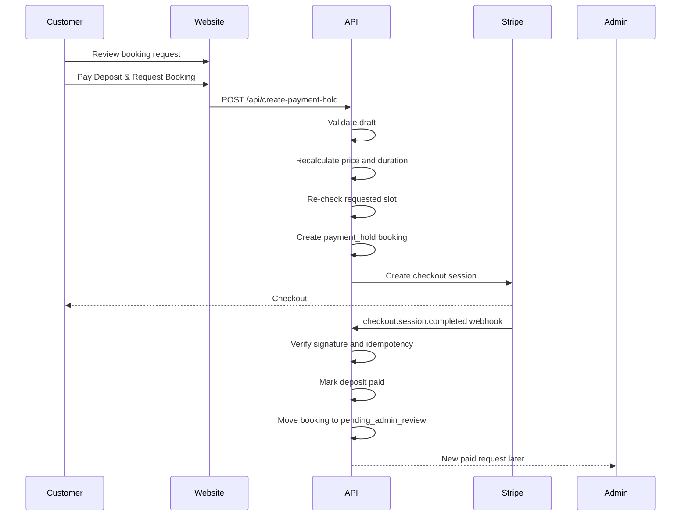

# AUTO VALET Payment Hold and Webhooks

This document defines the deposit checkout foundation. Payment does not approve a booking. A paid deposit moves a booking request to `pending_admin_review`, where AUTO VALET manually approves, declines, or suggests a new time.

## Flow Diagram



## Payment Hold Lifecycle

1. Customer submits the review step.
2. Server validates the booking draft.
3. Server recalculates price, deposit and duration.
4. Server re-checks the requested slot.
5. Server creates a `payment_hold` booking.
6. Hold expires after `15` minutes.
7. Stripe checkout starts.
8. Successful webhook moves the booking to `pending_admin_review`.
9. Failed or expired checkout releases the slot by changing status to `payment_failed` or `expired`.

Current implementation note: the database client is not configured yet, so `/api/create-payment-hold` fails safely with `PAYMENT_HOLD_PERSISTENCE_NOT_CONFIGURED`. It does not create a fake hold or fake checkout.

## Booking Status Transitions

```text
draft UI
  -> payment_hold
  -> pending_admin_review
  -> approved | declined | reschedule_requested
```

Payment success must never set `approved`. Only admin approval can confirm an appointment.

## Webhook Idempotency

Every webhook event must be stored before processing:

```text
gateway = stripe
event_id = Stripe event id
event_type = checkout.session.completed
payload = raw event JSON
processed_at = nullable timestamp
```

If the event id already exists, the webhook should return success without applying state changes again.

Current implementation note: webhook signature verification is scaffolded, but persistence is not configured. Actionable payment events return `WEBHOOK_PERSISTENCE_NOT_CONFIGURED` until webhook event storage and booking updates exist.

## Stripe Environment Variables

Required before real checkout:

```text
STRIPE_SECRET_KEY
STRIPE_WEBHOOK_SECRET
NEXT_PUBLIC_SITE_URL or SITE_URL
```

The server-side Stripe SDK package must also be installed:

```bash
npm install stripe
```

Card details must never be stored by AUTO VALET. Store only provider references, statuses, amounts and webhook ids.

## API Contracts

### Create Payment Hold

```http
POST /api/create-payment-hold
```

Request:

```json
{
  "draft": {
    "packageId": "maintenance",
    "vehicles": [
      {
        "id": "vehicle-1",
        "make": "BMW",
        "model": "3 Series",
        "size": "medium",
        "addons": ["engine_bay_clean"]
      }
    ],
    "postcode": "CR0 1AA",
    "fullAddress": "10 Example Road",
    "parkingAvailable": "yes",
    "parkingNotes": "",
    "accessNotes": "",
    "zoneCheckStatus": "standard_zone",
    "vehicleCount": 1,
    "selectedDate": "2026-05-18",
    "selectedSlotStart": "09:00",
    "customer": {
      "fullName": "Sarah Wilson",
      "phone": "07123456789",
      "email": "sarah@example.com"
    },
    "extraNotes": "",
    "marketingPhotoConsent": false
  },
  "idempotencyKey": "booking_hold_1234567890"
}
```

Success response once persistence and Stripe are configured:

```json
{
  "success": true,
  "data": {
    "bookingReference": "AV-2026-8F3K",
    "checkoutUrl": "https://checkout.stripe.com/...",
    "holdExpiresAt": "2026-05-18T10:15:00.000Z"
  }
}
```

Safe disabled response while persistence is missing:

```json
{
  "success": false,
  "error": {
    "code": "PAYMENT_HOLD_PERSISTENCE_NOT_CONFIGURED",
    "message": "Deposit checkout is not configured yet.",
    "details": {
      "reason": "Database persistence for payment_hold bookings is not configured."
    }
  }
}
```

### Stripe Webhook

```http
POST /api/payments/webhook
```

Handled event types:

- `checkout.session.completed`
- `payment_intent.payment_failed`
- `checkout.session.expired`

The route must read the raw body and verify the `stripe-signature` header before mapping the event.

## Failure Modes

- Invalid draft: return `BOOKING_VALIDATION_FAILED`.
- Missing idempotency key: return `IDEMPOTENCY_KEY_REQUIRED`.
- Requested slot taken: return `SLOT_UNAVAILABLE`.
- Persistence missing: return `PAYMENT_HOLD_PERSISTENCE_NOT_CONFIGURED`.
- Stripe SDK or keys missing: return `PAYMENT_PROVIDER_NOT_CONFIGURED`.
- Webhook signature missing or invalid: reject the webhook.
- Duplicate webhook: return success after confirming it was already processed.

## Testing Checklist

Before launch:

1. Payment hold created only after conflict check.
2. Hold expiry releases the slot.
3. Stripe checkout uses idempotency key.
4. Checkout success redirects to `/booking/success?reference=...`.
5. Checkout cancel redirects to `/booking/failed?reference=...`.
6. `checkout.session.completed` moves booking to `pending_admin_review`.
7. Payment success does not approve the booking.
8. Duplicate webhook event is ignored safely.
9. Failed payment marks the hold as failed.
10. Expired checkout marks the hold as expired.
11. No card details are stored.
